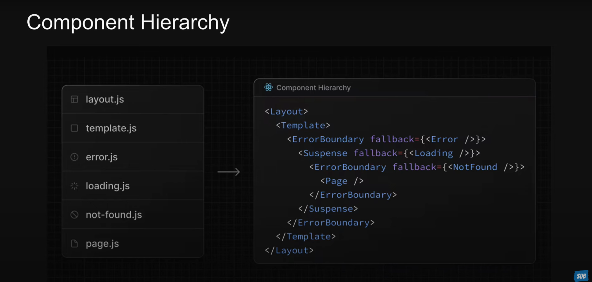

### [**Last** Video number : 29](https://www.youtube.com/watch?v=NPtnJ6Ivv9k&list=PLC3y8-rFHvwjOKd6gdf4QtV1uYNiQnruI&index=29&ab_channel=Codevolution)

---
- RSC
  - Server components
    - All Nextjs comp are server components
    - ability to run tasks like reading files or fetching data from a database
    - no ability to use hooks or handle intereactions
  - Client components
    - "use client" at the top of component
    - can't perform reading files , but they use hooks and manage interaction

---

- Routing
  - All routes must be in the app folder
  - Every route file must have name page.js or page.tsx
  - Every folder corresponds to the path segment
---
- Nested routes
    - blog folder
      - first folder
        - page.tsx
      - second folder
        - page.**tsx**
---
- Dynamic routes
  - products folder
    - [productId] folder
      - page.tsx
      - review folder 
        - [reviewId] folder
          - page.tsx
    - page.tsx
  
---
- Catch all segements
  - docs folder
    - [...slug] folder  // To show catch all segment page means all the links after docs/abc/...
      - page.tsx
    - [[...slug]] folder // To show inital doc page
---
- Not found page
  - Create file `not-found.tsx`
  - Call `import {notFound} method from 'next/navigatio'` to use notfound error page from anywhere
  -   `not-found.tsx` can be created on folder level too

---
- Private folders
  - A private folder private implementation details and should not be considered by routing system including its sub-folders
  - `_lib` is the private implementation
  - For seperating UI Logic
  - For consistently organizing internal files across a project
  - for sorting and grouping files in code editors
  - use '%5F' if you want to add underscore in the route then it will not be considered by private folder
---
- Route Groups 
  - It helps us to keep the url clean for  many folders but under same type like : auth/login, auth/signup, auth/logout => login,signup,logout
  - Use `(auth)` paranthese

---
- Route Group layout
  - Every folder can have its own layout.

---

- Title metadata
  - Page metadata will replace the layout metadata if they have the same properties
  - During merging the deepest section takes the priority 
  - For dynamic metadata , we can also make it dynamic
    ```
      const generateMetadata = ({ params }: Props): Metadata => {
       return {
        title: `Product ${params.productId}`,
       }
      }
    ```

---

- Title Metadata object
  ```
  export const metadata: Metadata = {
  title: {
    default: 'Learning Nextjs',
    template: '%s | learning nextjs', // Here %s will get replaced by title in the child
  },
  description: 'Generated by Next.js',
  }

  ```
---
- Navigating between route using App router
  - Use Link component for the Navigation client side
  - Use prop `replace` in the Link componentto replace the current history state in the browser
  - Programmatically navigate to to ` router.push('/') using useRouter or router.replace("/") or router.back()`

---
- Loading UI
  - In Nextjs when user navigate to the different routes in the same page it preserves the states.
  - Templates are similar to the layouts in that way they wrap each child layout or page. But with templates when a user navigated between routed that share a template a new instance of the component is mounted, DOM elements are recreated , state is preserved and effects are re-synchronized
  - Similar to layouts templates also should accept a children prop which will render the nested segements in the route
  - We should mostly rely on the layout 
---

- Loading.tsx special file
  - This file allows us to create loading state that are displayed to user while a specific route segmenr content is loading
  - The loading state appears immediately upon navigation, giving users the assurances that application is responsive and actively loading content
  - The file will automatically wrap page and all its nested children
  - Display the loading state as soon as user navigates to a new route
  - Creation of the shared layout that remain interactive while new rout segments are loading

---
- error.tsx 
  - It must be a client file
  - The rest of the UI will remain unaffected
  - You can design this error file as you want
  - Automatically wrap a route segment and its nested children in a React Error Boundary
  - We can also except the 
    ```
    {error}:{error:Erro}
    <div>{error.message}</div>
    ```
    
---

- Handling errors in the nested routes
  - You get inbuilt functionality like `rest` as param in ErrorBoundary funtion in error.tsx file.
  - To work with reset you need to make your page also "use client"
  - Error Boundary only moves to the first parent folder and replace the content of it with the  error.tsx file 
  - Error Boundary will not handle the error thrown in the layout.tsx in the same segment . To solve this we need to move the error.tsx file to the parent folder

---
- Parallel Routes
  - It is advance routing mechanism that allows for the simultaneous rendering of multiple pages within the same layout.
  - It is defined using the feature known as slots
  - To define a slot, we use the `@folder` naming convention
  - Each slot is then passed as a prop to its corresponding `layout.tsx` file
  - Benefit is their ability to split a single layout into various slots ,making the code more manageable
  - Independent routing handling 
    - Each sloth can have its own loading and error states
  - Each slot essentially function as a mini-application complete with its own navigation and state management

---
- Unmatched routes || Parallel Routing
  - Navigating from the UI 
    - In the case of navigation within the UI, Nextjs retains the previously active state of a slot regardless of changes in the URL
  - Page reload
    - Nextjs immediately searched for a deafult.tsx file within each unmatched slot
    - The presence of this file is critical as it provides the default content that Nextjs will render in the user interface
    - If this default.tsx file is missing in any of the unmatched slots for the current route Nextjs will render a 404
  - deafult.tsx file
    - The deafult.tsx file in the NExt.js serves as a fallback to render content when the framewrok cannot retrieve a slot's active state from the current URL